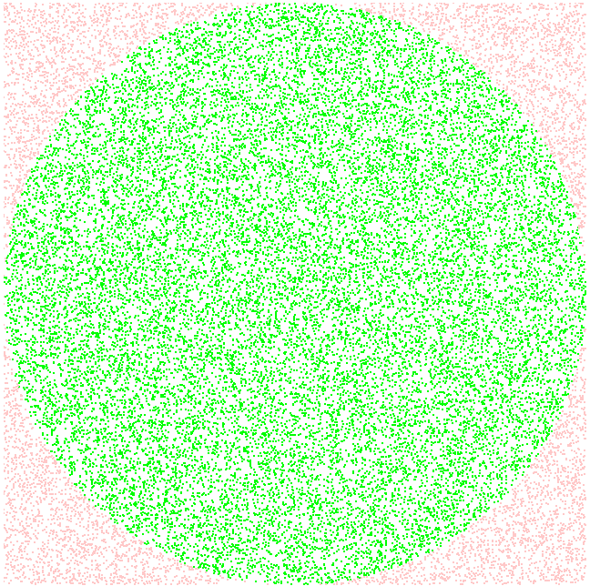

# Approximation of PI

Pi approximation using Monte Carlo method with quantum random numbers (QRNG@ANU JSON API).

## Screenshot

## How to use

### Clone the repository

`git clone https://github.com/kiralybalint/approximation-of-pi`

### Install Node dependencies

`cd approximation-of-pi && yarn install`

### Start webpack dev server

`yarn start`
